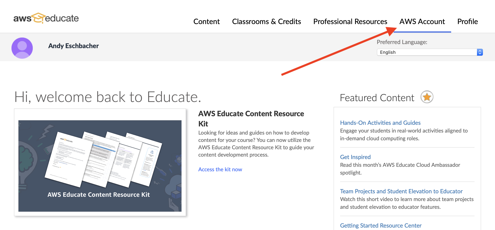
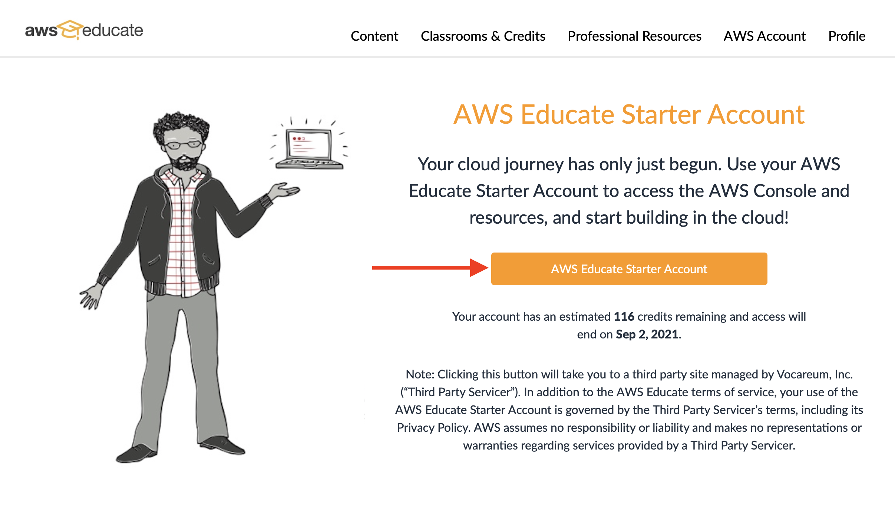
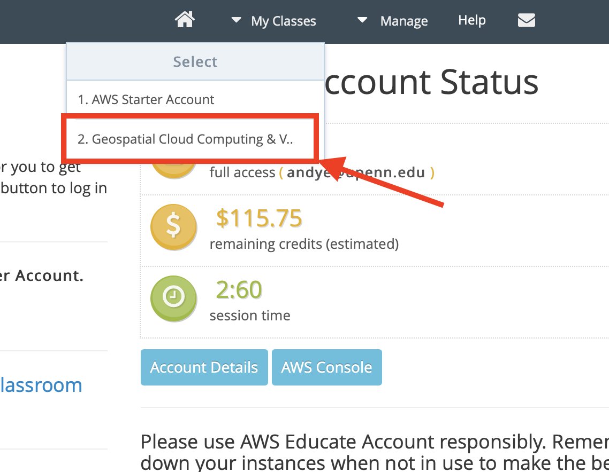
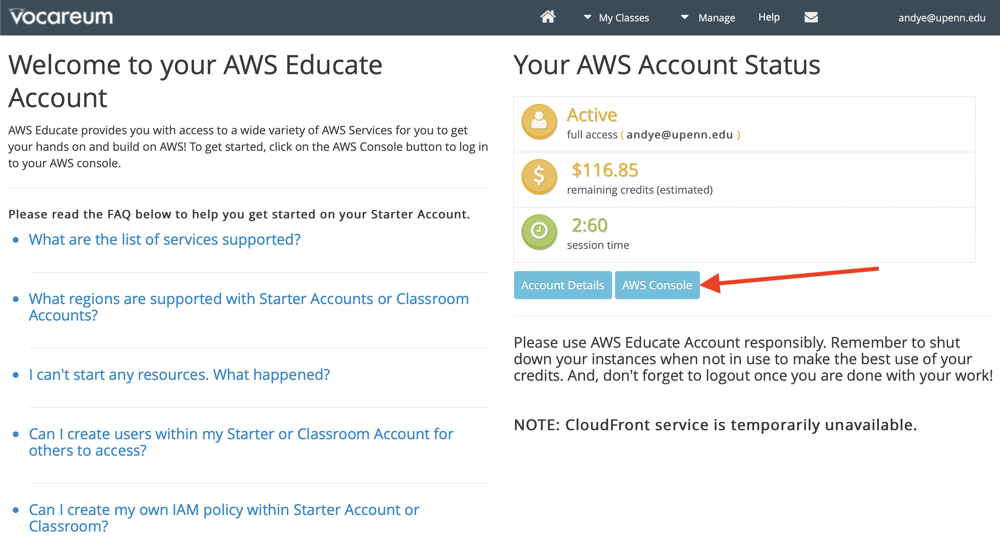
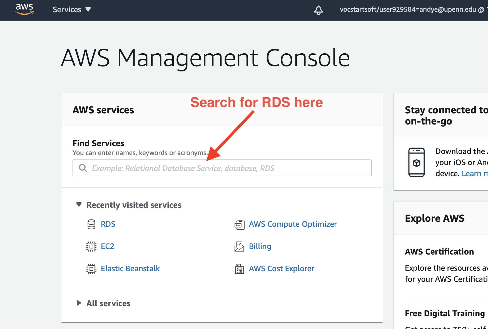
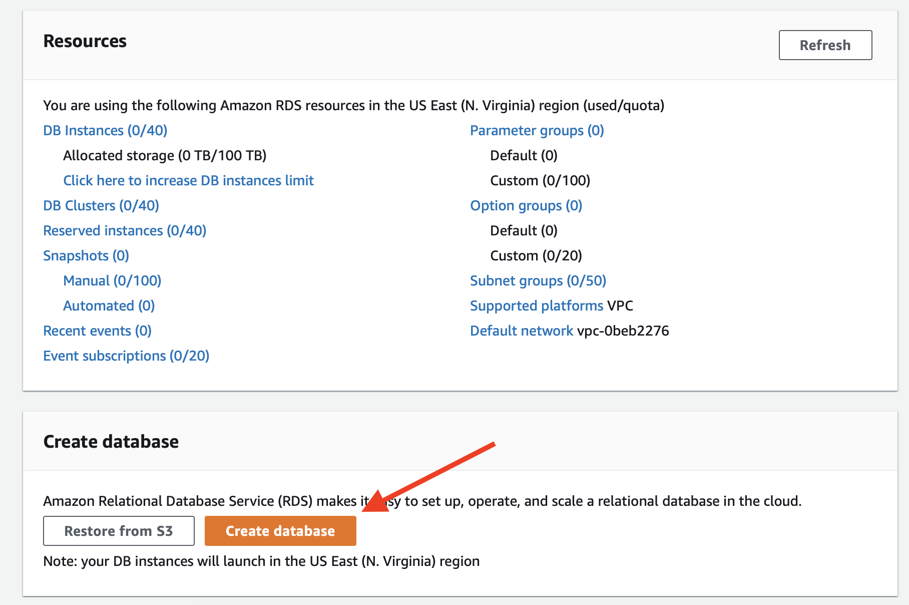

# Setting Up Your Own PostgreSQL Database

## Setting up a PostGIS Database on RDS

Similar instructions for [MySQL](https://aws.amazon.com/getting-started/hands-on/create-mysql-db/).

### Create a DB on RDS

1. Sign in to AWS Educate: https://www.awseducate.com/signin/SiteLogin
2. Click on AWS Account (give screenshot with arrow)
  
3. Click AWS Educate Starter Account
  
4. Choose our class account
  
5. Click AWS Console (popup window)
  
6. Search for RDS in console
  
7. Click "Create Database"
  
8. Select the following options
   * **Choose a database creation method**: Standard Create
   * **Engine Options**: Choose PostgreSQL
   * **Templates**: Choose Dev/Test
   * **Settings**:
     - Change username to something meaningful (and **write it down**)
     - Add password (and **write it down**)
   * **DB instance size**: Choose "Burstable" classes, `db.t3.micro` to start. If your queries are more intensive you can change this later.
   * **Storage**: Lower it to 5 GB. This is quite a lot and you can change it later if you need more.
   * **Connectivity** -> **Additional connectivity configuration**: Choose "Yes" under Public access
   * **Estimated monthly costs**: Note the estimated charges. This assumes you leave the DB running 24/7. You can stop it at any time when it won't be in use.
   * **Create Database**: Click "Create Database"
8. It will take about 5 minutes for the DB to get all setup.

### Add DB to pgAdmin

1. **Add DB to pgAdmin**: As information like the host is added to the DB console, add information to pgAdmin so you can access the database

### Create PostGIS Extension

1. **Open the Query Tool in pgAdmin**
2. Run the following query to install PostGIS on your database:
  ```SQL
    create extension postgis;
  ```
3. Check that PostGIS is installed:
   * Get PostGIS Version
     ```SQL
     SELECT PostGIS_full_version();
     ```
   * Run a sample query and view results:
   ```SQL
     SELECT
         ST_SetSRID(ST_MakePoint(10* random(), 10 * random()), 4326) as geom,
      	row_number() over () as gid
     FROM generate_series(1, 100)
   ```
4. Import data!
   * Getting data into a database can be pretty annoying.
   * We can import data using pgAdmin if the table is already created


Reference: <https://docs.aws.amazon.com/AmazonRDS/latest/UserGuide/Appendix.PostgreSQL.CommonDBATasks.html#Appendix.PostgreSQL.CommonDBATasks.PostGIS>

### Stopping DB

When you're finished working with the DB, you can stop it until you need to use it again. This saves money as the instance won't be running. AWS _will_ restart the server in seven days, though... Once we work on our applications, you'll want to keep the server running while the APIs are going though.
